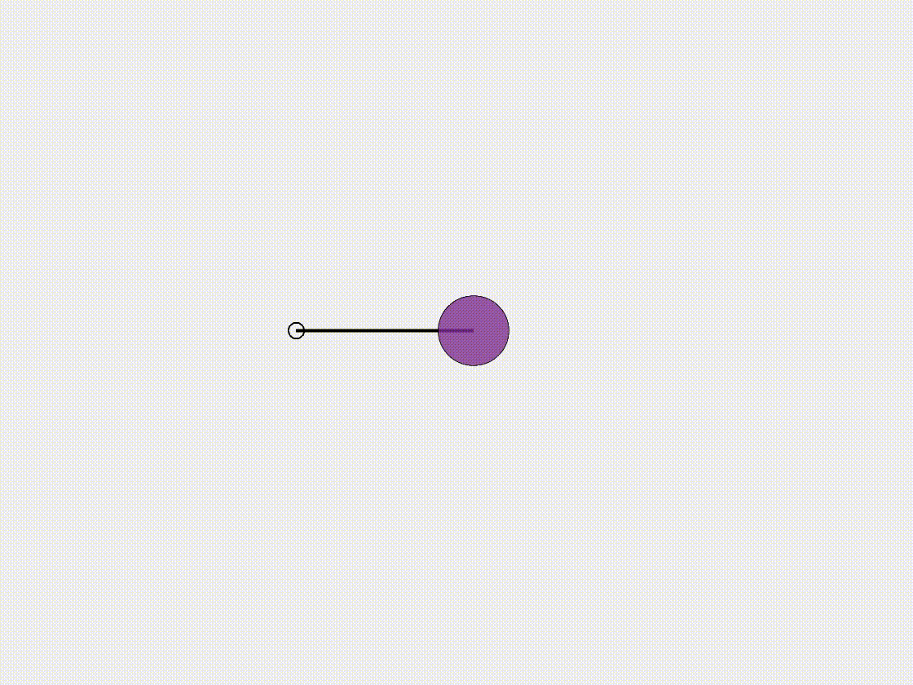
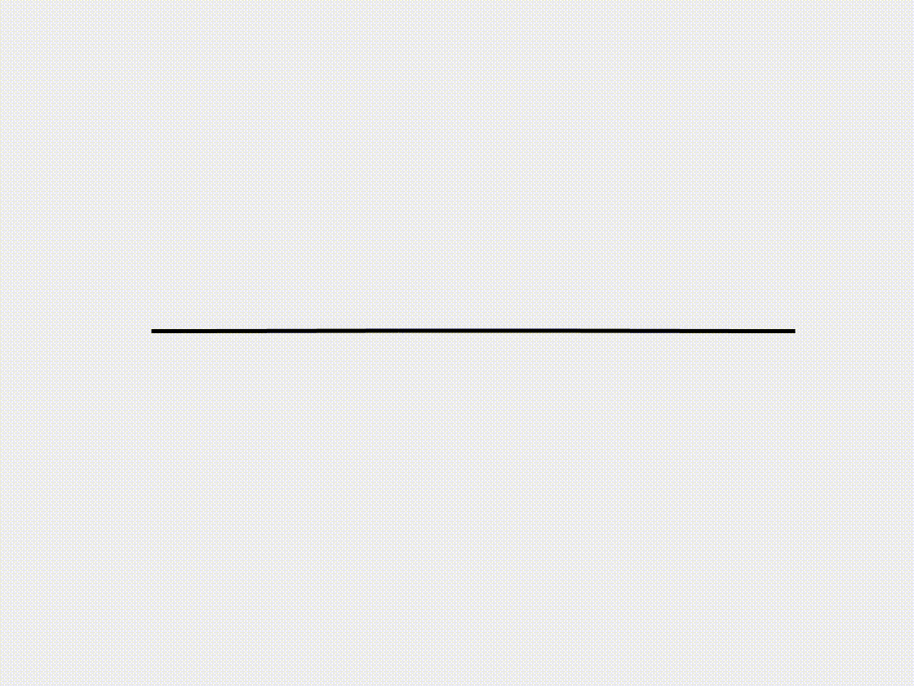
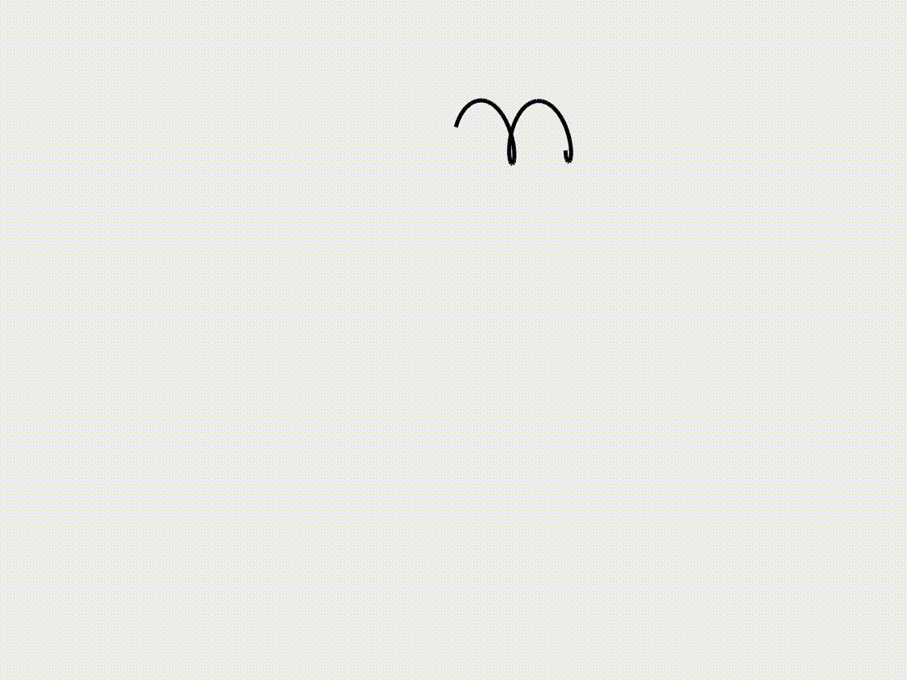
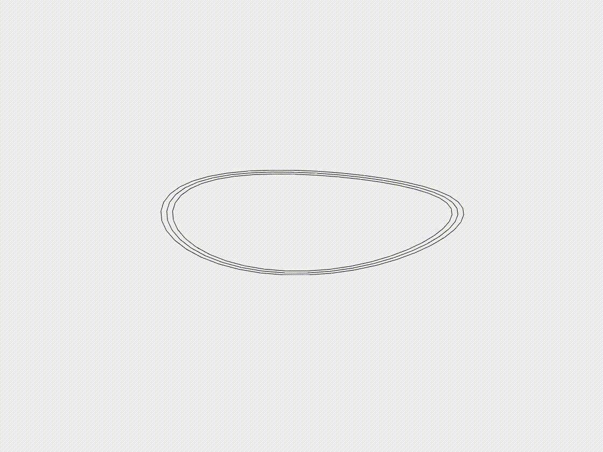
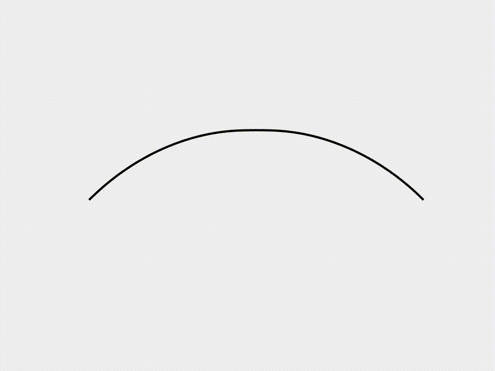
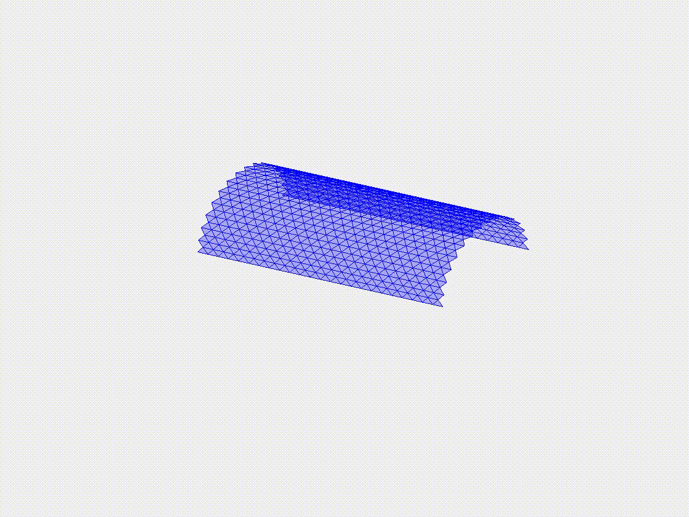
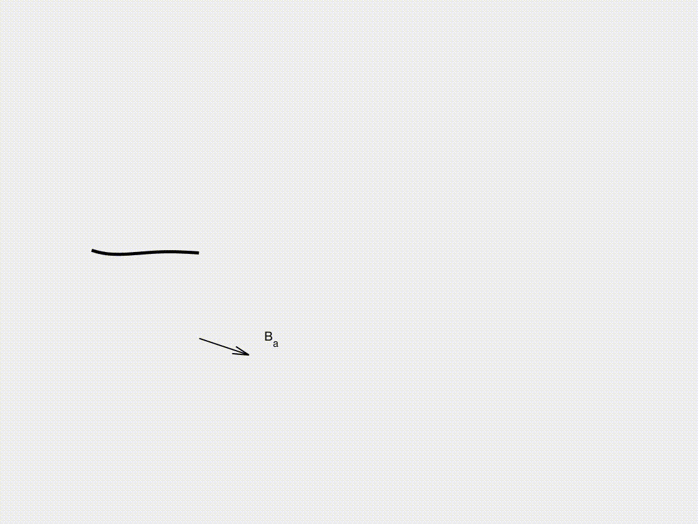
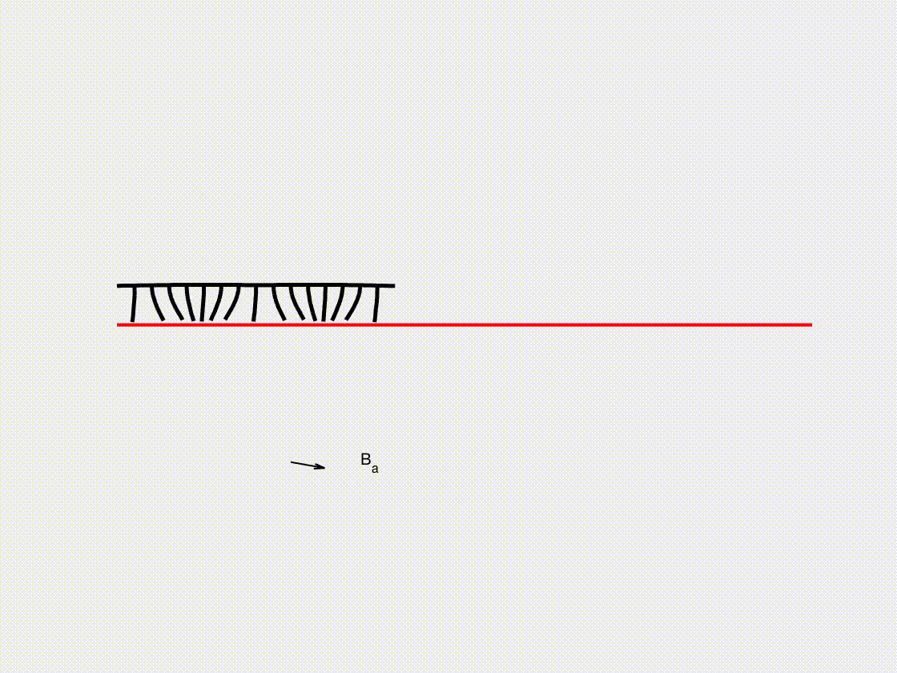

# [A tutorial for discrete differential geometry method](https://zhuonanhao.github.io/DDG_Tutorial_Website/)

This is a MATLAB1 tutorial for the nonlinear numerical simulation of flexible structures using the discrete differential geometry method. Note that this MATLAB-based code is for demonstration purposes and its
computational speed may be limited. The fast C/C++ version can be found [here](https://github.com/weicheng-huang-mechanics/DDG_Tutorial_Fast).

# Repository structure

- DDG_Tutorial

  - mass_spring_system
    - single_DOF: [Single DOF mass-spring-damper system](mass_spring_system/single_DOF)
    - multiple_DOF: [Multiple DOF mass-spring-damper system](mass_spring_system/multiple_DOF)
  - 2d_curve
    - case_1: [Beam deflection under gravity](2d_curve/case_1)
    - case_2: [Buckling of a compressive beam](2d_curve/case_2)
    - case_3: [Snapping of a pre-buckled beam](2d_curve/case_3)
  - 3d_curve
    - case_1: [3D helix under gravity](3d_curve/case_1)
    - case_2: [Bifurcation of pre-buckled ribbon](3d_curve/case_2)
    - case_3: [Growth of annular ribbon](3d_curve/case_3)
  - 2d_surface
    - case_1: [Inflation of an axisymmetric plate](2d_surface/case_1)
    - case_2: [Snap-through of the axisymmetric shell](2d_surface/case_2)
  - 3d_surface
    - case_1: [Plate deflection under gravity](3d_surface/case_1)
    - case_2: [Plate wrinkling under gravity](3d_surface/case_2)
    - case_3: [Indentation of a cylindrical shell](3d_surface/case_3)
  - rod_network
    - case_1: [Flexible net under gravity](rod_network/case_1)
    - case_2: [Form-finding of gridshell](rod_network/case_2)
    - case_3: [Lattice grid under gravity](rod_network/case_3)
  - hyper_elastic
    - case_1: [Hyperelastic planar cable](hyper_elastic/case_1)
    - case_2: [Hyperelastic axisymmetric membrane](hyper_elastic/case_2)
  - soft_robot
    - case_1: [Magnetic actuation](soft_robot/case_1)
    - case_2: [Fluid-structure interaction](soft_robot/case_2)
    - case_3: [Frictional contact](soft_robot/case_3)

# Demonstation

## Single DOF mass-spring-damper system
 

## Multiple DOF mass-spring-damper system
 

## Deflection of a cantilever beam under gravity
 

## Buckling of a compressive beam
 

## Snapping of a pre-buckled beam
 

## Deformation of a 3D helix under gravity
 

## Shear-induced bifurcation of a buckled ribbon 
 

## Growth of an annular ribbon
 

## Inflation of an axisymmetric plate
 

## Eversion of an axisymmetric shell cap
 

## Plate deflection under gravity
 

## Plate wrinkling under gravity
 

## Indentation of a cylindrical shell
 

## Net deflection under gravity
 

## Form-finding of gridshell
 

##  Lattice structure under gravity
 

##  Hyperelastic cable under vertical loading
 

##  Snapping of a hyperelastic torus
 

##  Beam under magnetic actuation
 

##  Soft swimming robot
 

##  Soft crawling robot
 
