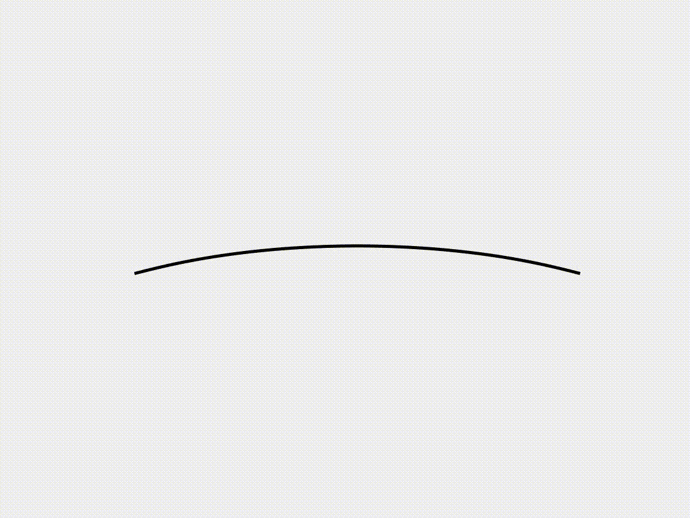
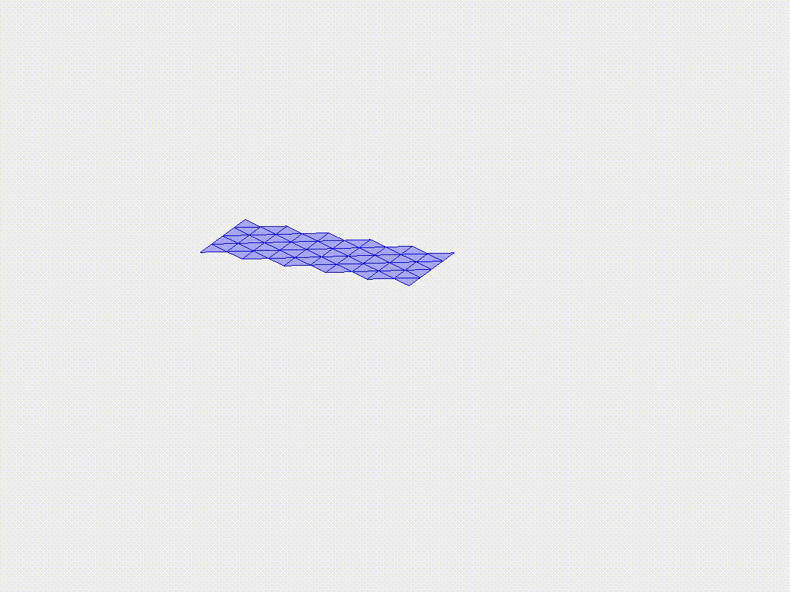
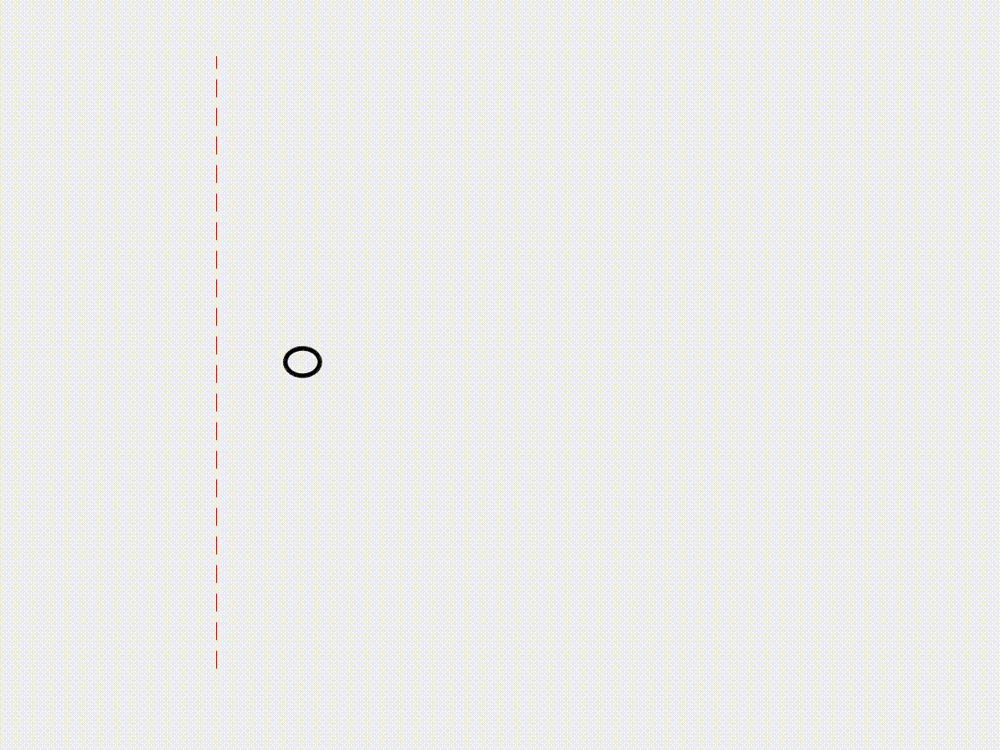

# A tutorial for discrete differential geometry method

This is a MATLAB tutorial for the nonlinear numerical simulation of flexible structures using the discrete differential geometry method.

# Repo struct
- DDG_Tutorial
  - 2d_curve
    - case_1: [beam deflection under gravity](2d_curve/case_1)
    - case_2: 
    - case_3
  - 2d_surface
    - Leaf 2.1
    - Leaf 2.2

# Beam under gravity
 

# Beam buckling 
 

# Beam snapping 
 

# Helical rod under gravity
 

# Shear-induced bifurcation of a buckled ribbon 
 

# Buckling of an annular ribbon
 

# Inflation of an axisymmetric plate
 

# Eversion of an axisymmetric shell cap
 

# Plate under gravity
 

# Plate wrinkling under gravity
 

# Net under gravity
 

# Buckling-induced form-finding of gridshell
 

#  Lattice structure under gravity
 

#  Hyperelastic cable under vertical loading
 

#  Snapping of a hyperelastic torus
 

#  Beam under magnetic actuation
 

#  Soft swimming robot
 

#  Soft crawling robot
 
