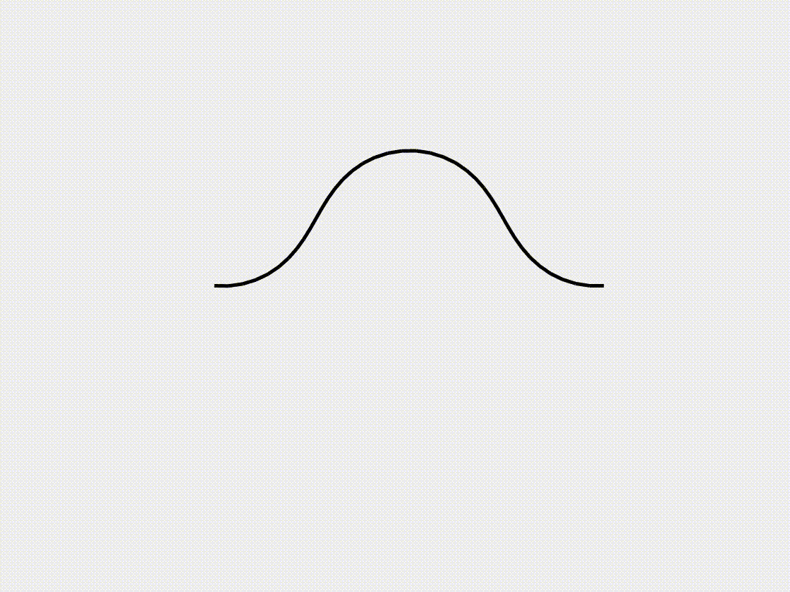
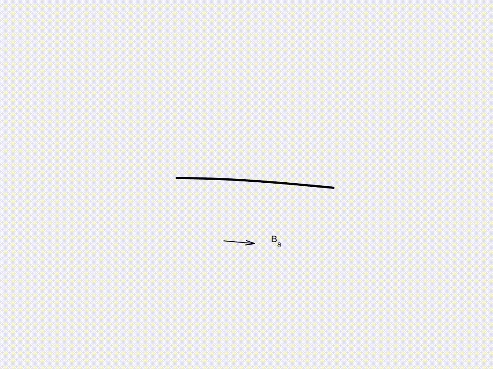

# A tutorial on the nonlinear numerical simulation of flexible structures by using the discrete differential geometry method

## Overview

Flexible elastic structures, such as beams, rods, ribbons, plates, and shells, exhibit complex nonlinear mechanical behaviors that are fundamental to numerous engineering and scientific applications, including soft robotics, deployable structures, and bio-inspired devices. The Discrete Differential Geometry (DDG) method has emerged as a robust numerical approach for modeling such structures, offering intrinsic geometric preservation, compatibility with large deformations, and computational efficiency. This tutorial provides a systematic introduction to the DDG method for numerical simulation of the nonlinear behavior of flexible structures. We first introduce the theoretical foundations of DDG, highlighting its advantages over conventional finite element and finite difference methods. We then present a step-by-step simulation framework, demonstrating the formulation of discrete elastic models for different structural forms and the numerical integration schemes required for time evolution. To illustrate the effectiveness of the DDG-based simulation approach, we showcase representative examples, including the nonlinear bending, twisting, and buckling of flexible structures. Moreover, we discuss the integration of external interactions, such as frictional contact, fluid-structure coupling, and magnetic actuation, enabling realistic simulations of flexible structures interacting with their environment. By providing a clear and practical guide, this tutorial aims to facilitate the adoption of DDG-based numerical tools for researchers and engineers working in computational mechanics, applied mathematics, and structural design.

# Beam under gravity
 

# Beam buckling 
 

# Beam snapping 
 

# Helical rod under gravity
 

# Shear-induced bifurcation of a buckled ribbon 
 

# Buckling of an annular ribbon
 

# Plate under gravity
 

# Plate wrinkling under gravity
 

# Net under gravity
 

# Buckling-induced form-finding of gridshell
 

#  Lattice structure under gravity
 

#  Beam under periodic magnetic actuation
 

#  Soft swimming robot
 

#  Soft crawling robot
 
